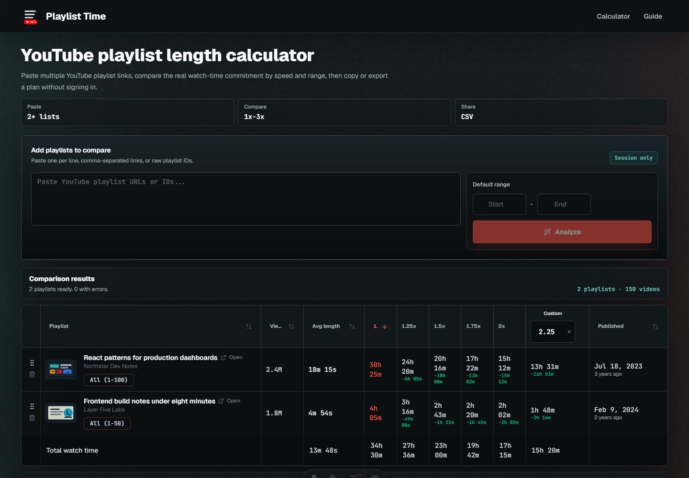

# Playlist Time 

YouTube playlist watch-time calculator for planning courses, study queues, and long playlists. Paste playlist URLs or IDs, compare totals at different playback speeds, narrow the calculation to a video range, plan daily progress, and export results.

[](https://github.com/zoypk/playlist-time/actions/workflows/ci.yml)
[](LICENSE)

[Live demo](https://playlist-time.pages.dev) | [Sample data view](https://playlist-time.pages.dev/?demo=1)



## Problem and User

YouTube shows playlist contents, but not the real time commitment for "videos 12-48 at 1.5x." playlist-time answers that question quickly while keeping YouTube API keys server-side.

playlist-time is for learners, course planners, students, creators, and anyone managing long YouTube playlists who needs to answer practical planning questions before they start watching:

- How long will this playlist take at my preferred speed?
- What happens if I only watch a specific range of videos?
- How many videos or minutes do I need per day to finish on time?
- Which playlist in a queue is the biggest time commitment?

## Core Features

- Analyze one or many playlists from pasted URLs or raw playlist IDs.
- Compare totals at 1x, 1.25x, 1.5x, 1.75x, 2x, or a custom speed.
- Apply a default video range, then adjust individual rows when needed.
- Sort playlist totals with thumbnails, channel names, views, publish dates, and durations.
- Estimate a daily finish date and videos-per-day target from the selected watch time.
- Copy a readable summary or download CSV results for planning and sharing.
- Load deterministic sample rows without calling the YouTube API.

## Tech Stack


- Astro 6 for the static site shell and build pipeline.
- React 19 and TypeScript for the interactive calculator.
- TanStack Query and TanStack Table for API state and sortable playlist results.
- Tailwind CSS, Radix UI primitives, and lucide-react for the interface.
- Bun for package management, local scripts, and unit tests.
- Cloudflare Pages Functions and Wrangler for the serverless API and deployment.
- YouTube Data API v3 for playlist metadata and video durations.

## Architecture Overview

- Astro serves the static shell; a React/TypeScript island owns the calculator state.
- Cloudflare Pages Functions proxy the YouTube Data API so `YOUTUBE_KEYS` never reaches the browser.
- The batch API de-duplicates playlist IDs, bounds concurrency, rotates API keys on quota/rate failures, and returns per-playlist errors.
- Successful API responses use a short Cloudflare edge cache; the browser keeps only session-level UI state.

```text
Browser
  -> Astro page + React calculator
  -> Cloudflare Pages Functions (/api/playlist, /api/playlists)
  -> YouTube Data API v3
```

Key files:

- `src/pages/index.astro` mounts the page shell and React app.
- `src/components/App.tsx` coordinates playlist input, speed/range controls, planning, and export flows.
- `src/components/PlaylistsTable.tsx` renders single-playlist and multi-playlist result states.
- `functions/api/playlist.ts` handles the single-playlist API route, YouTube calls, caching, and shared helpers.
- `functions/api/playlists.ts` handles batch playlist analysis.
- `src/shared/contracts.ts` keeps frontend/backend response shapes aligned.

## Local Setup

Prerequisites:

- Bun
- Wrangler, installed through the project dependencies
- One or more YouTube Data API keys

```bash
bun install
cp .dev.vars.example .dev.vars
```

Set local function variables in `.dev.vars`:

```env
YOUTUBE_KEYS=YOUR_YOUTUBE_DATA_API_KEY,YOUR_OPTIONAL_FALLBACK_YOUTUBE_DATA_API_KEY
```

Run the Astro frontend:

```bash
bun run dev
```

In a second terminal, run the local Pages Functions API:

```bash
bun run worker:dev
```

Astro proxies `/api/*` to `http://127.0.0.1:8788`, so both processes are needed for real YouTube API calls. The sample data route at `/?demo=1` can be used without API keys.

## Environment Variables

| Name | Required | Where | Purpose |
| --- | --- | --- | --- |
| `YOUTUBE_KEYS` | Yes for real API calls | `.dev.vars` locally; Cloudflare Pages environment variables in production | Comma-separated YouTube Data API keys. Multiple keys allow fallback when one key is quota-limited. |

Do not commit `.dev.vars`. If a real key is ever committed, revoke or rotate it before publishing.

For reporting security issues or accidental key exposure, see [SECURITY.md](SECURITY.md).

## Verification Status

Run the local checks:

```bash
bun run check
bun run test
bun run build
```

Current tests cover playlist input parsing, range normalization, API key parsing, cache-key generation, and bounded concurrency helpers. `bun run check` validates Astro and TypeScript, and `bun run build` verifies the production bundle.

One demo smoke test exists; fuller E2E coverage is future work.

## API Endpoints

- `GET /api/playlist?list=PLAYLIST_ID`
- `GET /api/playlist?list=PLAYLIST_ID&refresh=1`
- `GET /api/playlists?lists=ID1,ID2,ID3`
- `GET /api/playlists?lists=ID1,ID2,ID3&refresh=1`

The single-playlist route returns playlist metadata plus ordered video durations. The batch route accepts up to 50 valid playlist IDs and returns separate `results`, `errors`, and `meta` fields.

## Deployment

The app is deployed on Cloudflare Pages.

Build settings:

- Project name: `playlist-time`
- Build command: `bun run build`
- Build output directory: `dist`
- Functions directory: `functions`
- Production variable: `YOUTUBE_KEYS`

Cloudflare Pages runs production builds on deploy. This is a Pages project with Pages Functions, so deployments should use the Pages flow instead of `wrangler deploy`.

Manual deployment command:

```bash
bun run build
bun run deploy:pages
```

Production secrets should be configured in Cloudflare Pages, not committed to the repository.

## Screenshots and Demo

- Live app: [playlist-time.pages.dev](https://playlist-time.pages.dev)
- Deterministic sample: [playlist-time.pages.dev/?demo=1](https://playlist-time.pages.dev/?demo=1)
- Desktop screenshot: [docs/playlist-time-first-viewport.png](docs/playlist-time-first-viewport.png)
- Mobile screenshot: [docs/playlist-time-mobile.png](docs/playlist-time-mobile.png)
- Table detail screenshot: [docs/playlist-time-sample-rows.png](docs/playlist-time-sample-rows.png)

## Limitations

- Results depend on YouTube Data API availability, quota, and playlist visibility.
- Private, deleted, unavailable, or region-blocked videos can affect totals.
- The rate limiter is lightweight and per-runtime; it is not a durable abuse-prevention system.

## My Role

Personal project. I built the product scope, UI, serverless API, YouTube integration, caching behavior, deployment setup, and tests.

## License

GNU Affero General Public License v3.0 only (`AGPL-3.0-only`). See [LICENSE](LICENSE).
