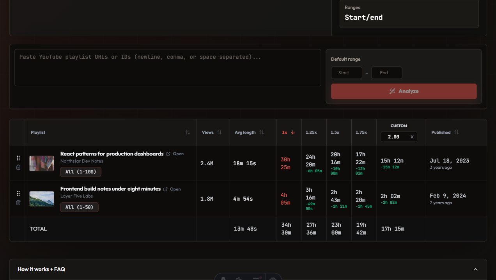

# yttime - YouTube Playlist Watch-Time Calculator

Serverless utility for calculating how long YouTube playlists take to watch at different playback speeds and video ranges.

Live demo: `https://yttime.pages.dev`

Built with Astro, React, TypeScript, Bun, and Cloudflare Pages Functions.



## What This Shows

- Product judgment: a focused utility with a clear user problem, not a generic portfolio clone.
- Frontend execution: Astro static shell with a React/TypeScript calculator island.
- Backend/API judgment: Cloudflare Pages Functions keep YouTube API keys server-side.
- Cost awareness: batch fetching, edge caching, client session caching, request deduplication, bounded concurrency, and API key rotation.
- Reviewer trust: safe environment examples, MIT license, CI, runnable commands, and tests for core parsing/range/API helpers.

## Core Features

- Analyze one or many playlists from pasted URLs or raw playlist IDs.
- Compare watch time at 1x, 1.25x, 1.5x, 1.75x, and a custom playback speed.
- Apply a default video range or adjust the range per playlist row.
- Compare playlist totals in a sortable table with thumbnails, channel names, views, publish dates, and totals.
- Load sample rows without calling the YouTube API.
- Keep YouTube API keys out of the browser.

## Architecture

```text
Browser
  |
  | Astro static page + React calculator island
  v
Cloudflare Pages Functions
  |
  | /api/playlist and /api/playlists
  v
YouTube Data API v3
```

The frontend parses playlist input, persists UI state in `sessionStorage`, and calls the batch API for valid playlist IDs. The Functions backend validates playlist IDs, rate-limits by client IP, fetches playlist/video metadata, rotates across configured API keys on quota/rate failures, and caches successful responses at the Cloudflare edge for 15 minutes.

## My Role

Personal project. I built the product, frontend interaction model, serverless API, caching approach, YouTube API integration, tests, CI, and deployment configuration.

## Tech Stack

- Astro static site
- React + TypeScript
- Bun
- Tailwind CSS
- TanStack Query
- TanStack Table
- Cloudflare Pages Functions
- YouTube Data API v3

## Local Setup

Install dependencies:

```bash
bun install
```

Create local Cloudflare function variables:

```bash
cp .dev.vars.example .dev.vars
```

Set `YOUTUBE_KEYS` in `.dev.vars`:

```env
YOUTUBE_KEYS=your_youtube_api_key_here,your_fallback_youtube_api_key_here
```

Never commit real API keys. If a real key was ever committed, revoke or rotate it in Google Cloud before making the repository public.

## Run Commands

Run the Astro app:

```bash
bun run dev
```

Run the Cloudflare Pages Functions API locally in another terminal:

```bash
bun run worker:dev
```

Astro dev proxies `/api/*` to `http://127.0.0.1:8788`, so both processes are needed for full local API testing.

Verify the repo:

```bash
bun run check
bun run test
bun run build
```

Preview the built site with Pages Functions:

```bash
bun run pages:dev
```

Deploy with Wrangler after configuring a Cloudflare Pages project:

```bash
bun run build
bun run deploy:pages -- --project-name <your-pages-project-name>
```

## Environment Variables

| Name | Required | Used by | Description |
| --- | --- | --- | --- |
| `YOUTUBE_KEYS` | Yes | Cloudflare Pages Functions | Comma-separated YouTube Data API v3 keys. Keep this in `.dev.vars` locally and in Cloudflare Pages environment variables in production. |

Production hygiene:

- Restrict YouTube API keys in Google Cloud where practical.
- Store `YOUTUBE_KEYS` only in Cloudflare Pages environment variables.
- Do not expose `.dev.vars` in screenshots, logs, issues, or README examples.

## API Endpoints

### `GET /api/playlist`

Fetch one playlist.

```text
/api/playlist?list=PLAYLIST_ID
/api/playlist?list=PLAYLIST_ID&refresh=1
```

Returns a compact playlist DTO:

```ts
type PlaylistDto = {
  playlistId: string;
  title: string;
  channelTitle: string;
  thumbnailUrl: string | null;
  publishedAt: string | null;
  totalVideoViewsSum: number;
  orderedDurationsSec: number[];
};
```

### `GET /api/playlists`

Fetch multiple playlists in one request.

```text
/api/playlists?lists=ID1,ID2,ID3
/api/playlists?lists=ID1,ID2,ID3&refresh=1
```

The batch route de-duplicates IDs, rejects invalid IDs, processes up to 50 valid playlist IDs per request, and returns separate `results`, `errors`, and `meta` fields.

## Cloudflare Pages Notes

For dashboard deployment:

- Build command: `bun run build`
- Build output directory: `dist`
- Functions directory: `functions`
- Required production variable: `YOUTUBE_KEYS`

Cloudflare Pages automatically deploys files under `functions/` as Pages Functions, so the API routes are versioned with the static Astro build.

## Testing And Verification

Current automated checks:

- `bun run check` runs Astro/TypeScript validation.
- `bun run test` covers playlist input parsing, range normalization, API key parsing, cache-key generation, and bounded concurrency helpers.
- `bun run build` verifies the production Astro build.
- GitHub Actions runs install, check, test, and build on pushes and pull requests.

## Tradeoffs And Limitations

- Results depend on YouTube Data API availability, quota, and playlist visibility.
- Private, deleted, unavailable, or region-blocked videos can affect totals.
- Edge cache entries are intentionally short-lived to balance cost and freshness.
- The in-memory rate limiter is lightweight and per-runtime; it is not a durable abuse-prevention system.
- The frontend stores session state locally in the browser rather than in a user account.
